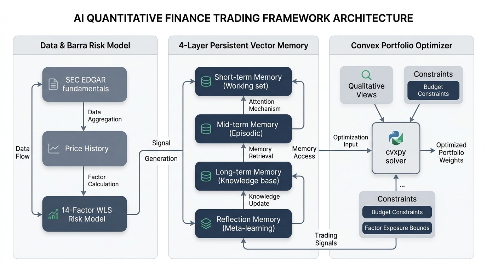

# Memory-Augmented LLM Investment Agents Under Convex Risk-Constrained Portfolio Allocation

Sequential portfolio management requires synthesizing qualitative narrative evidence with quantitative market statistics, maintaining a persistent memory of past market regimes, and mapping qualitative asset views into mathematically optimal position allocations. Existing Large Language Model (LLM) financial agents predominantly suffer from two structural limitations: they evaluate decisions statelessly without historical memory feedback, failing to adapt across changing market regimes, and they convert directional calls into portfolio weights via simplistic heuristics that ignore systematic factor exposure, covariance shrinkage, and convex allocation constraints. This project addresses both limitations by implementing a memory-augmented LLM trading-agent framework evaluated on a joint 15-asset portfolio across 10 US equities, 2 crypto assets, and 3 ETFs.

The underlying data infrastructure materializes daily price history from 2015 through 2023 alongside point-in-time SEC EDGAR fundamentals. Point-in-time correctness is structurally enforced: corporate filings and financial ratios become usable only from their actual SEC filing date onward, avoiding look-ahead bias. Crypto and ETF assets explicitly handle non-applicability of corporate filings via a structured sentinel pattern. Systematic risk is modeled using a genuine Barra-style multi-factor risk model consisting of 10 static SIC Industry Divisions and 4 cross-sectionally normalized style factors (Size, Value, Momentum, Volatility). Factor returns are estimated daily via weighted least squares regression across a separate 300-stock estimation universe subject to an industry-neutrality identification constraint.

Experience is accumulated across four distinct memory layers—short, mid, long, and reflection—each characterized by specific recency time-constants, importance decay factors, and migration thresholds. When retrieving past experience, memory items are ranked by a compound score combining embedding similarity, importance score, and exponential recency decay. Memories that repeatedly inform profitable trades receive incremental importance updates via a five-day return look-back feedback loop, promoting high-consequence insights into longer-horizon layers. Periodically, high-level synthetic reflections are distilled from short-term memory clusters and deduplicated via vector cosine similarity.

Qualitative asset decisions—comprising direction, conviction score, and evidence rationale—are generated daily using trailing price trends, point-in-time fundamentals, and retrieved past memories. Rather than sizing positions independently, these qualitative views are transformed into a single joint portfolio via convex optimization. The objective function maximizes expected portfolio return penalized by risk under a Ledoit-Wolf constant-correlation shrunk covariance matrix. Physical portfolio budget bounds, qualitative conviction limits, and explicit linear bounds on all 14 Barra factor exposures are strictly enforced within the convex solver, ensuring that active qualitative views do not induce unintended systematic factor concentrations.

The framework evaluates out-of-sample portfolio breadth—a computed measure of uncorrelated bets ($1 / \hat{w}^T R_{\text{shrunk}} \hat{w}$)—and realized factor exposures alongside annualized Sharpe ratio, cumulative return, and maximum drawdown. Benchmarks are established against passive Buy-and-Hold and daily Equal-Weight baseline strategies across both proprietary closed-source models and self-hosted open-weight LLM backbones under strict out-of-sample isolation.

Implementation details, execution commands for Tiers 1 through 3, and Vast.ai GPU deployment steps live in `runbook.md`.
